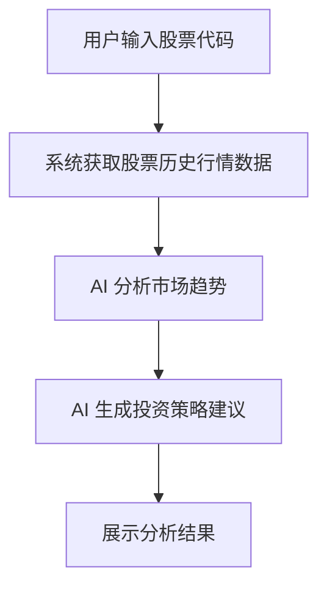

# AI 投研 Agent — PRD（V1）

## 1. 产品背景

近年来，个人投资者获取股票信息的渠道日趋丰富，但信息来源高度分散——行情数据、新闻资讯、技术指标分布在多个平台，普通投资者难以从海量数据中快速提炼有效判断。

当前主流行情软件（如同花顺、东方财富）已能提供较完善的行情数据与资讯聚合，但在 **数据深度分析** 与 **策略辅助生成** 方面仍存在空白，用户依然需要依赖自身经验进行研判。

随着大语言模型（LLM）能力的快速演进，AI 在数据摘要、趋势研判和策略推理方面展现出显著潜力。基于此，本产品拟构建一款 **AI 投研 Agent**，旨在帮助用户高效完成股票数据分析并生成参考性投资策略，从而显著提升信息处理效率。

---

## 2. 产品目标

构建一个基于 AI 的投研辅助工具，核心目标如下：

| **编号** | **目标** | **说明** |
| --- | --- | --- |
| G1 | 自动获取股票历史行情数据 | 用户输入股票代码即可一键拉取关键行情指标 |
| G2 | AI 驱动的趋势分析 | 基于历史数据与技术指标，自动输出趋势研判报告 |
| G3 | 自动生成投资策略建议 | 在趋势分析基础上输出可操作的策略参考 |
| G4 | 直观的分析结果展示 | 通过图表与结构化文本降低用户理解门槛 |

<aside>
⚠️

**产品定位**：本产品为 **投研辅助工具**，仅提供分析参考，不涉及自动交易，不构成任何投资建议。

</aside>

---

## 3. 目标用户

### 3.1 个人投资者

- 对股票投资有一定兴趣与基础认知
- 希望快速获取结构化分析信息，减少跨平台信息筛选时间
- 有自主决策能力，但期望 AI 提供辅助参考

### 3.2 投资初学者

- 缺乏系统性技术分析能力
- 希望获得简单直观的分析结论与操作建议
- 偏好"一键式"体验，降低学习成本

---

## 4. 用户需求分析

通过对股票投资场景的拆解，可提炼出以下核心需求：

| **需求编号** | **需求描述** | **用户痛点** | **优先级** |
| --- | --- | --- | --- |
| N1 | 快速获取股票数据 | 需在多个平台间切换查找数据，效率低 | P0 |
| N2 | 辅助判断股票趋势 | 缺乏专业技术分析能力，难以快速研判 | P0 |
| N3 | 获得投资建议参考 | 希望在趋势分析基础上获得可操作的策略参考（如关注区间、目标价等） | P1 |

---

## 5. 核心功能设计（V1）

V1 版本聚焦于 **单只股票分析场景**，包含以下四个功能模块：

### 5.1 股票数据获取模块

> **目标**：用户输入股票代码，系统自动获取历史行情数据，为后续分析提供数据基础。
> 

**输入**：股票代码（如 `600519`、`AAPL`）

**输出字段**：

| 字段 | 说明 |
| --- | --- |
| 开盘价 | 当日开盘价格 |
| 收盘价 | 当日收盘价格 |
| 最高价 | 当日最高价格 |
| 最低价 | 当日最低价格 |
| 成交量 | 当日成交数量 |
| 时间序列 | 按交易日排列的历史数据 |

**数据来源**：第三方股票数据 API（如 Tushare、Yahoo Finance 等）

### 5.2 AI 市场趋势分析模块

> **目标**：基于历史行情数据，利用 AI 输出结构化的趋势研判报告。
> 

**分析维度**：

- **趋势判断**：上涨 / 下跌 / 震荡
- **技术指标摘要**：均线排列、MACD、RSI 等关键指标总结
- **短期风险提示**：量价背离、超买超卖等异常信号

**示例输出**：

```
该股票近期整体呈震荡上行趋势，短期均线形成多头排列，
但成交量有所下降，短期需关注回调风险。
```

### 5.3 投资策略生成模块

> **目标**：在趋势分析基础上，AI 进一步生成结构化投资策略建议。
> 

**输出内容**：

- **关注建议**：是否建议近期关注
- **关注区间**：建议介入的价格区间
- **目标价格**：预期上行目标价
- **止损价格**：建议风控止损位
- **风险提示**：当前主要风险因素

**示例输出**：

```
建议在 170–175 区间关注该股票，
目标价 190，止损价 165。
当前主要风险：大盘系统性回调、行业政策不确定性。
```

### 5.4 分析结果展示模块

> **目标**：将行情数据与 AI 分析结果以直观方式呈现给用户。
> 

**展示内容**：

- 股票价格走势图（K 线图 / 折线图）
- AI 市场趋势分析报告
- 投资策略建议卡片

**展示形式（V1）**：

- 命令行终端输出（MVP 最小化方案）
- 简单 Web 页面展示（可选扩展）

---

## 6. 产品流程



该流程构成完整的 **「输入 → 分析 → 输出」** 产品使用闭环。

---

## 7. MVP 版本范围

<aside>
🎯

**V1 原则**：以最小可用产品验证核心价值，降低开发复杂度。

</aside>

**V1 包含能力**：

- [x]  股票数据获取
- [x]  AI 趋势分析
- [x]  投资策略生成
- [x]  分析结果展示

**V1 不包含**：

- [ ]  真实交易 / 模拟交易功能
- [ ]  新闻情绪分析
- [ ]  多股票对比
- [ ]  用户账户体系

---

## 8. 后续版本规划（V2+）

| **版本** | **功能** | **价值说明** |
| --- | --- | --- |
| V2 | 新闻情绪分析 | 结合舆情数据提升趋势研判准确性 |
| V2 | 多股票对比分析 | 支持横向对比，辅助选股决策 |
| V3 | 模拟交易功能 | 零风险验证策略有效性 |
| V3 | 投资收益统计 | 量化回测，提升用户信任度 |
| V3 | 自动投资周报生成 | 定期推送持仓分析与市场洞察 |

---

## 9. 技术方案概述

### 系统架构


### 主要技术组件

| 组件 | 技术选型 | 说明 |
| --- | --- | --- |
| 数据处理 | Python + Pandas | 行情数据清洗与特征计算 |
| 数据源 | Tushare / Yahoo Finance API | 历史行情数据获取 |
| AI 分析引擎 | LLM（GPT-4 / Claude 等） | 趋势研判与策略生成 |
| 可视化展示 | Matplotlib / Streamlit | 图表渲染与页面展示 |

---

## 10. 产品边界与免责声明

<aside>
⚖️

本产品为 **投研辅助工具**，仅提供信息分析与策略参考，**不构成任何投资建议**。

- 所有分析结果基于历史数据与模型推理，不保证未来收益
- 用户需自行承担投资决策及相关风险
- 本产品不涉及任何资金托管或交易执行
</aside>

---

## 附录：文档版本记录

| 版本 | 日期 | 修改内容 | 作者 |
| --- | --- | --- | --- |
| V1.0 | 2026-03-14 | 初始版本 | — |